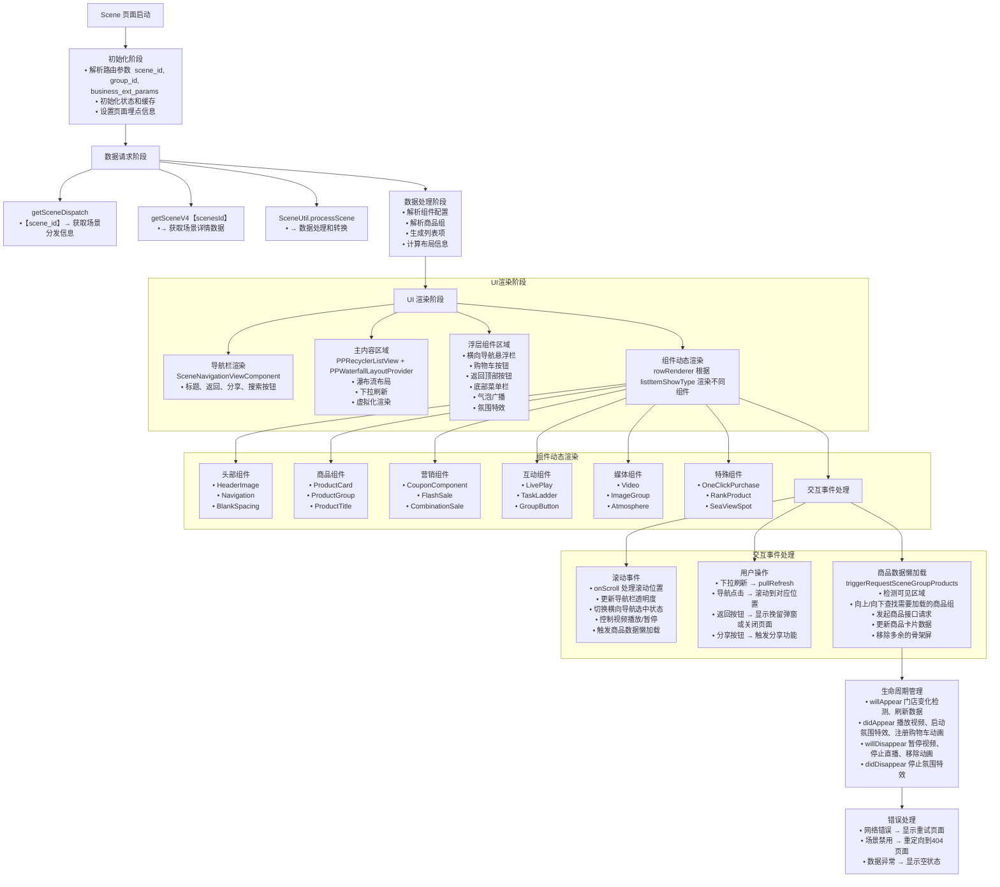

# 主题场景学习

## 一、整体页面布局

  

    
    
    
	

  

    
    
    
	

  

    
    
    
	

## 二、代码结构目录

src/pages/scene

~~~pgsql
scene/                  # 场景模块根目录，通常用于存放特定业务场景相关的代码
├─ assets/              # 场景专用的静态资源目录
│  └─ images/           # 场景专用的图片资源（如背景图、场景特定图标等）
│
├─ components/          # 场景专用的组件目录（仅在当前场景内使用的组件）
│  ├─ AtmosphereComponent/        # 氛围组件（可能用于营造特定场景氛围，如节日装饰等）
│  ├─ BlankSpacingView/           # 空白间隔视图（用于布局中的留白、分隔）
│  ├─ BottomMenuComponent/        # 底部菜单组件（场景底部的操作菜单）
│  ├─ BroadcastBubble/            # 广播气泡组件（可能用于显示滚动通知、广播消息）
│  ├─ CombinationSale/            # 组合销售组件（用于展示捆绑销售的商品）
│  ├─ coupon/                     # 优惠券相关组件（基础优惠券展示）
│  ├─ couponComponent/            # 优惠券组件（可能是更复杂的优惠券展示/选择组件）
│  ├─ CustomNavigationBar/        # 自定义导航栏组件（场景专用的顶部导航）
│  ├─ FlashCoupon/                # 限时优惠券组件（用于展示闪购优惠券）
│  ├─ floatViewComponent/         # 悬浮视图组件（悬浮在页面上的操作按钮或提示）
│  ├─ goToShoppingCartComponent/  # 去购物车组件（跳转到购物车的快捷入口）
│  ├─ GroupButtonComponent/       # 分组按钮组件（一组相关操作按钮，如筛选、排序）
│  ├─ GroupTitle/                 # 分组标题组件（用于划分内容区块的标题）
│  ├─ GuideView/                  # 引导视图组件（新用户引导、功能介绍弹窗）
│  ├─ headerImageComponent/       # 头部图片组件（场景顶部的 banner 或标题图）
│  ├─ imageComponent/             # 图片展示组件（场景专用的图片加载/展示组件）
│  ├─ liveComponent/              # 直播相关组件（如直播入口、直播状态展示）
│  ├─ NavigationViewComponent/    # 导航视图组件（场景内的子导航）
│  ├─ OneClickPurchaseComponent/  # 一键购买组件（快捷下单的操作组件）
│  ├─ product/                    # 商品相关组件（如商品卡片、属性选择等）
│  ├─ SceneFlashSaleComponent/    # 场景闪购组件（场景内的限时闪购模块）
│  ├─ SceneNavigation/            # 场景导航组件（场景内页面间的跳转导航）
│  ├─ SeaViewSpot/                # 海景组件（可能是特定场景的展示组件，如旅游场景的海景图）
│  ├─ TaskLadderComponent/        # 任务阶梯组件（如等级任务、阶梯奖励展示）
│  └─ VideoPlayerComponent/       # 视频播放器组件（场景内的视频播放功能）
│
├── service/              # 【接口服务层】封装场景相关的接口请求逻辑
│   └── service.ts   
├── type/                 # 【类型定义目录】统一管理场景相关的 TypeScript 类型
│   ├── componentTypes.ts        				# 组件类型定义，描述组件属性、结构的 TS 类型
│   ├── productGroupComponentTypes.ts   # 产品组组件类型，定义产品组关联组件的类型约束
│   ├── sceneComponentContent.ts        # 场景组件内容类型，规范场景组件内容结构
│   ├── sceneCouponTypes.ts             # 场景优惠券类型，处理优惠券相关的类型定义
│   ├── sceneResultItemVO.ts            # 场景结果项值对象类型，定义场景结果数据结构
│   └── types.ts                        # 通用类型集合，场景相关零散或通用的 TS 类型写在此处
├── utils/                		 # 【工具函数目录】存放场景业务的工具方法
│   ├── SceneComponentUtil.ts  # 场景组件工具类，封装操作场景组件的通用函数（如组件数据转换、校验等）
│   ├── SceneProductUtil.tsx   # 场景产品工具类
│   ├── SceneResultCache.tsx   # 场景结果缓存工具，用于缓存场景结果数据，优化性能或状态管理
│   ├── SceneTrackUtil.ts      # 场景埋点/追踪工具，封装数据埋点、行为追踪逻辑
│   └── SceneUtil.ts           # 场景通用工具类，存放不便于归类的场景工具函数
│
├─ index.tsx            # 场景入口文件（导出场景的根组件或核心功能）
│
└─ SceneSearchPage.tsx  # 场景搜索页面（当前场景的搜索功能页面）
~~~

src/components/product/ProductCardV2

~~~pgsql
ProductCardV2/
├── area/                          # 可能用于不同区域/模块的卡片布局
├── card/                          # 与产品卡片相关的组件
│   ├── cardModel/                 # 产品卡片的数据模型或逻辑
│   ├── personalizedCard/          # 个性化卡片组件
│   ├── skeletonView/              # 骨架屏组件，用于加载占位
│   ├── ProductLine1Card.tsx       # 产品线1普通卡片
│   ├── ProductLine1EfficiencyCard.tsx   # 产品线1效率卡片
│   ├── ProductLine1MinimizeCard.tsx     # 产品线1缩略卡片
│   ├── ProductLine2Card.tsx       # 产品线2普通卡片
│   ├── ProductLine3Card.tsx       # 产品线3普通卡片
│   └── ProductLine3MinimizeCard.tsx     # 产品线3缩略卡片
├── component/                     # 组件集合，可能是通用或可复用组件
│   └── controls/                  # 控制类组件
│       ├── PersonalizedControls/  # 个性化控制组件集合
│       ├── ProductCardPurchaseButtonControl.tsx   # 购买按钮
│       ├── ProductCardSoldOutButtonControl.tsx    # 售罄按钮
│       ├── ProductCardStepperControl.tsx         # 数量选择步进器
│       ├── ProductCardTextControl.tsx            # 文本显示控件
│       ├── ProductGraphicControl.tsx             # 图片/图形控件
│       ├── ProductLabelControl.tsx               # 标签显示控件
│       ├── ProductLinePriceControl.tsx           # 产品线价格显示
│       ├── ProductMainPriceControl.tsx           # 主价格显示
│       ├── ProductMarketingControl.tsx           # 营销信息控件
│       ├── ProductMixControl.tsx                 # 混合展示控件
│       ├── ProductOptionControl.tsx              # 选项控件
│       ├── ProductPriceLabelControl.tsx          # 价格标签控件
│       ├── ProductSpuMixControl.tsx              # SPU混合控件
│       ├── ProductSpuTextControl.tsx             # SPU文本控件
│       ├── ProductStockControl.tsx               # 库存控制显示
│       ├── ProductSubPriceControl.tsx            # 子价格显示
│       └── ProductTextControl.tsx                # 文本控件
├─ dislike/
│  ├─ assets/
│  ├─ guide/
│  │  ├─ DislikeGuideComponent.tsx	# 引导组件，渲染不喜欢功能的引导弹窗、浮层等，承载引导交互逻辑
│  │  └─ DislikeGuideUIConfig.ts		# 集中管理引导弹窗的样式（标题、文案、按钮文案等）、布局参数
│  ├─ hook/
│  │  └─ useDislike.tsx							# 「不喜欢」功能专属 Hook 目录
│  ├─ menu/	# 「不喜欢」菜单功能子模块，负责“不喜欢”相关的菜单（如弹窗菜单、底部菜单）
│  │  ├─ DislikeMenuComponent.tsx		# 菜单组件，渲染「不喜欢」功能的交互菜单
│  │  └─ DislikeMenuUIConfig.ts			# 菜单 UI 配置文件，管理菜单选项文案、样式、布局
│  ├─ service/											# 基础服务工具文件，可封装通用请求方法、基础数据处理
│  │  ├─ service.ts									# 业务服务类，封装「不喜欢」功能的核心业务逻辑
│  │  └─ DislikeManager.tsx
└─ model/
   ├─ ProductAddPurchaseModel.ts    # 产品加购相关数据模型，定义加购流程所需字段、类型
   ├─ ProductBaseInfo.ts						# 产品基础信息模型，定义产品卡片基础字段
   ├─ ProductCardGeneralModel.ts		# 产品卡片通用数据模型，整合卡片展示、交互所需的综合数据结构
   └─ DislikeShowModel.ts						# “不喜欢”功能专用展示模型，定义“不喜欢”相关 UI 渲染所需数据

~~~

### 1.模块定位与核心功能

从代码结构看，该模块是一个 “主题场景页面”（电商场景中的专题页，如节日促销、场景化导购等），核心功能包括：

- 场景化页面布局（图片展示、分区内容）；
- 集成多种业务组件（商品卡片、优惠券、闪购、导航等）；
- 基础交互（如商品加购、不喜欢、跳转等）。

### 2.目录职责

- `src/pages/scene`：聚焦页面整体逻辑（入口文件、路由配置、数据聚合）；
- `components`：逐个攻克场景专用组件（先从简单的`BlankSpacingView`、`GroupTitle`入手，再到复杂的`SceneFlashSaleComponent`、`ProductCardV2`）；
- `service/type`：理解数据接口格式和类型定义（这是组件与数据交互的基础）；
- `ProductCardV2`：作为核心依赖组件，重点学习其不同产品线卡片的差异（如`ProductLine1Card`与`ProductLine3Card`的布局 / 数据字段区别）和交互逻辑（购买、售罄、不喜欢等）。

### 3.**组件复用与数据流转**

该模块依赖大量组件（如商品卡片、优惠券），重点分析：

- 组件间如何传参（如场景页面向商品卡片传递商品 ID、价格等数据）；
- 通用逻辑如何封装（如`useDislike.tsx`这样的 Hook，避免重复代码）；
- 静态资源（图片、样式）的管理方式（是否复用公共资源，还是场景专属）。

## 三、复现

**“先整体梳理框架→拆分核心模块→分阶段边学边复现”** 

### 阶段 1：搭建 “骨架”

目标：实现页面基础布局和最简化组件，跑通 “静态页面”。

- 复现`scene/index.tsx`的整体结构（引入`BlankSpacingView`、`GroupTitle`等简单组件，用静态数据填充布局）；
- 实现`ProductCardV2`的最简化版本（如`ProductLine1Card.tsx`只展示图片、标题、价格，不做交互）；
- 忽略复杂逻辑（如 “不喜欢”、加购、倒计时），先保证页面结构正确。

#### 1.index.tsx

##### 页面主要构成

###### 1. 页面框架

- **导航栏**：自定义导航栏，支持透明、搜索、分享等功能
- **下拉刷新**：支持下拉刷新整个页面数据
- **瀑布流布局**：使用 **PPRecyclerListView**实现高性能列表

###### 2. 核心组件类型

 **头部组件**

- **头图/视频**：页面顶部的横幅图片或视频
- **横向导航**：类似标签页的水平导航栏
- **气泡广播**：浮动的消息提示

**商品展示组件**

- **商品卡片**：多种样式（普通、直降、评论版等）
- **商品组**：按类别分组的商品展示
- **瀑布流商品**：Pinterest 风格的商品展示

**营销组件**

- **优惠券**：各种优惠券展示和领取
- **秒杀组件**：限时抢购商品
- **组合销售**：搭配销售商品
- **一键购买**：快速下单功能

**互动组件**

- **直播组件**：商品直播展示
- **视频播放器**：商品介绍视频
- **任务阶梯**：用户任务系统

**底部组件**

- **购物车按钮**：浮动购物车入口
- **底部菜单**：快捷操作菜单
- **返回顶部**：快速回到页面顶部

##### Scene页面整体逻辑流程图

###### 关键控制流程

1. 数据流

~~~
路由参数 → 接口请求 → 数据处理 → UI渲染 → 用户交互 → 数据更新
~~~

2. 渲染流程

~~~
PPRecyclerListView → layoutProvider → rowRenderer → 具体组件 → 用户界面
~~~

3. 交互流程

~~~
用户操作 → 事件处理 → 状态更新 → UI重新渲染 → 视觉反馈
~~~

4. 性能优化

~~~
虚拟化列表 → 懒加载 → 缓存机制 → 防抖处理 → 内存管理
~~~

##### Scene 页面商品类型分析

###### 1. 按展示布局分类

**基础布局类型**

|       类型       |   展示方式   |    SceneListItemShowType     |
| :--------------: | :----------: | :--------------------------: |
|   **一行一列**   | 单行单个商品 |   ProductCardNormal (1200)   |
|   **一行二列**   | 单行两个商品 |    ProductCardFlow (1204)    |
|   **一行三列**   | 单行三个商品 | ProductCardThreeColumn(1206) |
| **一行二瀑布流** |  瀑布流布局  |  ProductCardFlowList(1207)   |
|   **两行横滚**   | 水平滚动两行 |   ProductCardTowRow(1208)    |
|   **单行横滚**   | 水平滚动单行 |   ProductCardOneRow (1209)   |

**特殊展示类型**

|      类型      |     展示方式     |  SceneListItemShowType   |
| :------------: | :--------------: | :----------------------: |
| **评价商品卡** | 带评价信息的商品 | ProductCardComment(1205) |
|  **一键加购**  | 快速添加到购物车 | OneClickPurchase (1210)  |
|   **排行榜**   |  排行榜样式展示  |    RankProduct (1301)    |

###### 2. 按氛围样式分类

**直降商品卡**（Big Sale）根据**氛围强度**和**布局**组合：

**重氛围样式**（Weight）

- **一行一列**：ProductCardLine1BigSaleWeightA (1201),  ProductCardLine1BigSaleWeightB (1211)
- **一行二列**：ProductCardLine2BigSaleWeightA (1214),  ProductCardLine2BigSaleWeightB (1215)
- **一行三列**：ProductCardLine3BigSaleWeightA (1218),  ProductCardLine3BigSaleWeightB (1219)

**轻氛围样式**（Light）

- **一行一列**：ProductCardLine1BigSaleLightA (1212),  ProductCardLine1BigSaleLightB (1213)
- **一行二列**：ProductCardLine2BigSaleLightA (1216),  ProductCardLine2BigSaleLightB (1217)
- **一行三列**：ProductCardLine3BigSaleLightA (1220),  ProductCardLine3BigSaleLightB (1221)

###### 3. 骨架屏类型

每种商品展示类型都有对应的骨架屏：

| 真实组件                 | 骨架屏组件                              |
| ------------------------ | --------------------------------------- |
| [ProductCardNormal]      | [ProductCardNormalSkeleton] (1100)      |
| [ProductCardFlow]        | [ProductCardFlowSkeleton] (1104)        |
| [ProductCardFlowList]    | [ProductCardFlowListSkeleton] (11041)   |
| [ProductCardComment]     | [ProductCardCommentSkeleton] (1105)     |
| [ProductCardThreeColumn] | [ProductCardThreeColumnSkeleton] (1106) |
| [ProductCardOneRow]      | [ProductCardOneRowSkeleton] (1108)      |

###### 4. 特殊商品组件类型

**营销相关**

| 类型         | 说明         | SceneListItemShowType |
| ------------ | ------------ | --------------------- |
| **限时抢购** | 秒杀商品     | [FlashSale] (1401)    |
| **海景房**   | 特殊展示区域 | [SeaViewSpot] (1501)  |

**无商品状态**

| 类型       | 说明           | SceneListItemShowType  |
| ---------- | -------------- | ---------------------- |
| **无商品** | 商品为空或不够 | [ProductCardNull] (-2) |

###### 5. 数据模型结构

~~~typescript
// 商品行数据
interface SceneResultProductLineData {
 showType: ProductCardShowTypeV2;      // 商品卡片类型
 productCardUIConfig: ProductCardUIConfig; // 样式配置
 personalizedAreaStyle?: ProductCardPersonalizedAreaStyle; // 个性化区样式
 productItems: SceneResultProductData[];  // 该行包含的商品数据
 isShowRank: boolean;            // 是否显示排行榜
 bgImageUrl?: string;            // 背景图片
}

// 单个商品数据
interface SceneResultProductData {
 productCardGeneralModel?: ProductCardGeneralModel; // 商品卡数据模型
 productCommentData?: ProductCommentDataModel;   // 商品评价数据
 productIndex: number;               // 商品索引
}
~~~

###### 总结

Scene 页面支持 **20+ 种商品展示类型**，主要通过：

- **布局方式**：1列、2列、3列、横滚、瀑布流
- **氛围样式**：普通、直降重氛围、直降轻氛围
- **特殊功能**：评价、排行榜、一键加购、限时抢购
- **加载状态**：每种类型都有对应的骨架屏

##### Scene 页面开发任务表格

| 任务编号       | 类别 | 任务名称                     | 优先级 | 预估难度 | 依赖关系  | 状态 | 备注                  |
| -------------- | ---- | ---------------------------- | ------ | -------- | --------- | ---- | --------------------- |
| **基础组件层** |      |                              |        |          |           |      |                       |
| T001           | 基础 | SceneBlankSpacingView        | P0     | ⭐        | 无        | ⏳    | 最简单的空白间距组件  |
| T002           | 基础 | SceneNavigationViewComponent | P0     | ⭐⭐       | T001      | ⏳    | 导航栏组件（基础版）  |
| T003           | 基础 | SceneImageComponent          | P1     | ⭐⭐       | T001      | ⬜    | 图片展示组件          |
| T004           | 基础 | PUILoading                   | P0     | ⭐        | 无        | ⏳    | 加载状态组件          |
| T005           | 基础 | FailureView                  | P1     | ⭐        | 无        | ⬜    | 错误状态页面          |
| **布局核心**   |      |                              |        |          |           |      |                       |
| T006           | 核心 | PPRecyclerListView集成       | P0     | ⭐⭐⭐      | T001-T005 | ⏳    | 列表容器（关键）      |
| T007           | 核心 | PPWaterfallLayoutProvider    | P0     | ⭐⭐⭐      | T006      | ⬜    | 瀑布流布局提供者      |
| T008           | 核心 | 下拉刷新机制                 | P1     | ⭐⭐       | T006      | ⬜    | NativeRefreshControl  |
| **数据层**     |      |                              |        |          |           |      |                       |
| T009           | 数据 | Scene数据接口对接            | P0     | ⭐⭐⭐      | 无        | ⏳    | getSceneV4 接口       |
| T010           | 数据 | SceneUtil数据处理            | P0     | ⭐⭐⭐      | T009      | ⏳    | 数据转换和处理        |
| T011           | 数据 | 缓存机制实现                 | P2     | ⭐⭐       | T009,T010 | ⬜    | 各种Cache组件         |
| **商品组件**   |      |                              |        |          |           |      |                       |
| T012           | 商品 | SceneProductRowNormal        | P1     | ⭐⭐⭐      | T006      | ⬜    | 普通商品卡片          |
| T013           | 商品 | 商品骨架屏组件               | P1     | ⭐⭐       | T012      | ⬜    | 加载占位组件          |
| T014           | 商品 | 商品组标题组件               | P1     | ⭐        | T003      | ⬜    | ProductGroupTitle系列 |
| T015           | 商品 | 瀑布流商品组件               | P2     | ⭐⭐⭐      | T012,T007 | ⬜    | 双列瀑布流            |
| **营销组件**   |      |                              |        |          |           |      |                       |
| T016           | 营销 | SceneCouponComponent         | P2     | ⭐⭐       | T003      | ⬜    | 优惠券组件            |
| T017           | 营销 | FlashCouponComponent         | P2     | ⭐⭐       | T016      | ⬜    | 闪购优惠券            |
| T018           | 营销 | CombinationSaleComponent     | P2     | ⭐⭐⭐      | T012      | ⬜    | 组合销售              |
| **导航系统**   |      |                              |        |          |           |      |                       |
| T019           | 导航 | SceneHorizontalNavigation    | P1     | ⭐⭐⭐      | T006      | ⏳    | 横向导航栏            |
| T020           | 导航 | 导航吸顶逻辑                 | P1     | ⭐⭐       | T019      | ⬜    | Sticky效果            |
| T021           | 导航 | 导航与滚动联动               | P1     | ⭐⭐⭐      | T019,T020 | ⬜    | 滚动时导航切换        |
| **头部组件**   |      |                              |        |          |           |      |                       |
| T022           | 头部 | SceneHeaderImageComponent    | P1     | ⭐⭐       | T003      | ⬜    | 头图组件              |
| T023           | 头部 | 头图视频播放                 | P2     | ⭐⭐⭐      | T022      | ⬜    | 视频播放逻辑          |
| **交互组件**   |      |                              |        |          |           |      |                       |
| T024           | 交互 | SceneGoToShoppingCartView    | P2     | ⭐⭐       | T012      | ⬜    | 购物车按钮            |
| T025           | 交互 | ScrollToTopFloatButtonView   | P2     | ⭐        | T006      | ⬜    | 返回顶部按钮          |
| T026           | 交互 | SceneBottomMenuComponent     | P2     | ⭐⭐       | T003      | ⬜    | 底部菜单栏            |
| **高级功能**   |      |                              |        |          |           |      |                       |
| T027           | 高级 | SceneLiveComponent           | P3     | ⭐⭐⭐⭐     | T022      | ⬜    | 直播组件              |
| T028           | 高级 | VideoPlayerComponent         | P3     | ⭐⭐⭐      | T023      | ⬜    | 视频播放器            |
| T029           | 高级 | SceneBroadcastBubbleView     | P2     | ⭐⭐       | T002      | ⬜    | 气泡广播              |
| T030           | 高级 | AtmosphereView               | P3     | ⭐⭐⭐      | T006      | ⬜    | 氛围特效              |
| **页面集成**   |      |                              |        |          |           |      |                       |
| T031           | 集成 | 页面生命周期管理             | P1     | ⭐⭐       | T006      | ⬜    | LCPage集成            |
| T032           | 集成 | 错误处理机制                 | P1     | ⭐        | T005,T009 | ⬜    | 统一错误处理          |
| T033           | 集成 | 路由注册                     | P0     | ⭐        | 所有组件  | ⏳    | component-registry    |
| T034           | 集成 | 页面测试和调优               | P1     | ⭐⭐       | 所有任务  | ⬜    | 性能优化              |

图例说明

- **优先级**: P0(必须) > P1(重要) > P2(一般) > P3(可选)
- **难度**: ⭐(简单) ⭐⭐(中等) ⭐⭐⭐(困难) ⭐⭐⭐⭐(很困难)
- **状态**: ⬜(待开始) ⏳(进行中) ✅(已完成) ❌(已取消)

###### 建议的开发阶段

1. 第一阶段（MVP）: T001→T004→T006→T009→T010→T033

完成基础页面框架，能显示基本内容

2. 第二阶段（核心功能）: T002→T007→T012→T013→T019→T022

实现主要业务组件

3. 第三阶段（完善功能）: T008→T014→T016→T020→T021→T024→T025

增加交互和用户体验

4. 第四阶段（高级功能）: T015→T018→T026→T027→T029→T030

实现高级特性

5. 第五阶段（优化）: T031→T032→T034

性能优化和测试

### 阶段 2：攻克 “核心组件”

目标：让核心组件具备基础交互能力。

- 深入`ProductCardV2`的`component/controls`（实现购买按钮`ProductCardPurchaseButtonControl`的点击事件，绑定简单的加购逻辑）；
- 理解`model`层（如`ProductBaseInfo.ts`定义的商品字段，确保组件接收的数据格式正确）；
- 集成`SceneFlashSaleComponent`的基础展示（静态展示闪购商品，暂不实现倒计时）。

#### 第一阶段：布局基础组件

1. **SceneBlankSpacingView** - 空白间距
2. **SceneNavigationViewComponent** - 导航栏
3. **SceneHeaderImageComponent** - 头图

#### 第二阶段：展示组件

1. **SceneImageComponent** - 图片组件
2. 商品标题组件：
   - ProductGroupTitleTextComponent
   - ProductGroupTitleImageComponent

#### 第三阶段：业务组件

1. **简单商品卡片**：SceneProductRowNormal
2. **优惠券组件**：SceneCouponImageView

#### 第四阶段：复杂组件

1. **横向导航**：SceneHorizontalNavigation
2. **直播组件**：SceneLiveComponent

#### 主题场景 ID 逻辑何时介入？

**在第三阶段**开始引入：

- 有了基础展示能力后
- 开始需要真实数据进行测试时
- 实现数据获取逻辑：getSceneV4()

### 阶段 3：集成 “复杂逻辑”

目标：加入交互细节和跨组件逻辑。

- 学习`dislike`功能的实现（从`useDislike.tsx`的 Hook 逻辑入手，理解 “不喜欢” 状态如何影响商品展示，再集成`DislikeMenuComponent`弹窗）；
- 实现`SceneFlashSaleComponent`的倒计时功能（依赖`service`层的时间接口，或用本地定时器模拟）；
- 调试组件间数据传递（如场景页面筛选条件变化时，`ProductCardV2`如何更新商品列表）。

### 阶段 4：补充 “边缘功能”

目标：完善非核心但必要的功能。

- 实现`GuideView`引导弹窗、`floatViewComponent`悬浮按钮等；
- 优化样式适配（如不同屏幕尺寸下的布局调整）。
